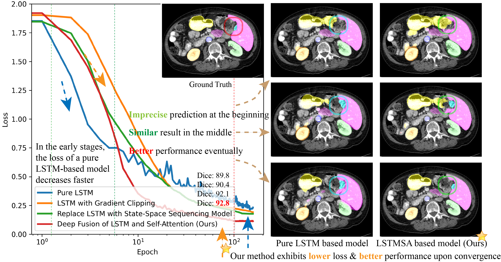
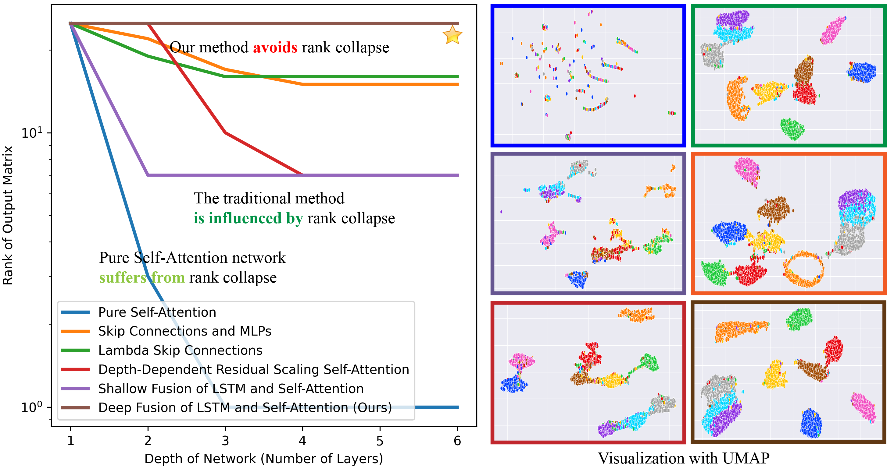

# Enhancing Medical Image Segmentation with Self-Attention-Embedded LSTM Mechanism

- Paper for IEEE Transactions on Instrumentation and Measurement source code is available. (Under Review) [2024.12.26]

## Motivation

- Our model facilitates a slower rate of exponential decay in the learning process, promoting better long-term memory retention and a more **stable convergence** than traditional LSTM networks.

- Our model reserves high-dimensional feature representations by leveraging the original LSTM structure, which enhances the learning of scaling factors and improves initialization to help avoid **rank collapse** issue in the self-attention mechanism.

## Structure

## Requirements

1. pytorch >= 1.11.0
2. numpy
3. medpy

## Dataset

In the case of 2D input, we evaluate the performance of our proposed modules on the following datasets:

* Synapse dataset: This dataset comprises multiple organ segmentation tasks. ([link](https://www.synapse.org/\#!Synapse:syn3193805/wiki/217789))
* ISIC2018 dataset: This dataset focuses on the segmentation of skin lesions. ([link](https://challenge.isic-archive.com/landing/2018/))

For the 3D input scenario, we conduct experiments on the following datasets:

* ACDC dataset: This dataset involves the segmentation task of the heart. ([link](https://www.creatis.insa-lyon.fr/Challenge/acdc/))
* CVC-ClinicDB dataset: This dataset pertains to polyp segmentation in colonoscopy videos and has been used for comparing automatic segmentation methods. ([link](https://polyp.grand-challenge.org/CVCClinicDB/))

## Train and Evaluation on Sample Dataset and Baseline presented in the paper

- Step 1, prepare the dataset, you can download the ACDC dataset from the [link](https://www.creatis.insa-lyon.fr/Challenge/acdc/).
- Step 2, install the required packages.
- Step 3, download the pretrained model from the [link](https://drive.google.com/file/d/1Y2j5RpWRKy9c2_9ZpuI_0bH8JR1_WADD/view?usp=sharing).
- Step 4, using `train.py` to train or using the pretrained model to evaluate the model.
- To help check whether the results are reproduced, we present the training and evaluation logs in the `train.log`.

## Train and Evaluation on Other Datasets and Baselines

You need to modify the corresponding code in the baseline to use our proposed modules.
The open source code of baselines is listed as follows:

#### Baseline on Synapse and ACDC datasets

* [TransUNet](https://github.com/Beckschen/TransUNet)
* [MT-UNet](https://github.com/Dootmaan/MT-UNet)
* [MISSFormer](https://github.com/ZhifangDeng/MISSFormer)
* [DAEFormer](https://github.com/mindflow-institue/DAEFormer)
* [MERIT](https://github.com/SLDGroup/MERIT)

#### Baseline on ISIC2018 dataset

* [UNet](https://github.com/TomAndHelen/UNet_Family)
* [ResUNet](https://github.com/TomAndHelen/UNet_Family)
* [DWUNet](https://github.com/TomAndHelen/UNet_Family)
* [UNet++](https://github.com/TomAndHelen/UNet_Family)
* [DCSAU-Net](https://github.com/xq141839/DCSAU-Net)

#### Baseline on CVC-ClinicDB dataset

* [FCBFormer](https://github.com/ESandML/FCBFormer)
* [SSFormer-L](https://github.com/Qiming-Huang/ssformer)
* [HarDNet-DFUS](https://github.com/YuWenLo/HarDNet-DFUS)
* [FANet](https://github.com/feinanshan/FANet)
* [ESFPNet](https://github.com/dumyCq/ESFPNet)
