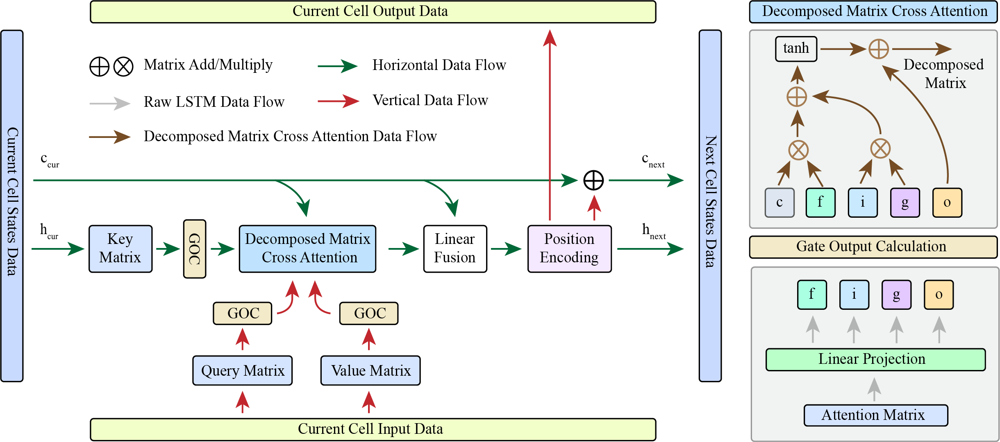

# Enhancing Medical Image Segmentation with Self-Attention-Embedded LSTM Mechanism

TNNLS paper is accepted.

## Abstract

Medical image segmentation plays a pivotal role in various clinical applications, but it remains challenging due to the complex structures and the need for accurate localization of anatomical regions. In this paper, we propose a novel deep learning model called LSTMSA, which integrates a Self-Attention (SA) mechanism within a Long Short-Term Memory (LSTM) module to address two key challenges in medical image segmentation. Firstly, traditional approaches suffer from premature convergence during training, leading to suboptimal segmentation results, particularly in the early stages of training. LSTMSA achieves a more balanced training process by embedding SA within LSTM, allowing the model to focus on local information early on while fully leveraging LSTM's temporal modeling capabilities throughout training. Secondly, SA mechanisms often introduce rank collapse issues, potentially resulting in information loss and blurred segmentation in complex medical images. LSTMSA is designed to preserve high-dimensional feature representations, ensuring that fine details and contextual information are maintained. Experimental results on medical image datasets demonstrate the superiority of LSTMSA over existing methods, achieving state-of-the-art segmentation accuracy and preserving critical anatomical features.

## Structure

## Requirements

1. pytorch
2. numpy

## Dataset

In the case of 2D input, we evaluate the performance of our proposed modules on the following datasets:

* Synapse dataset: This dataset comprises multiple organ segmentation tasks. ([link](https://www.synapse.org/\#!Synapse:syn3193805/wiki/217789))
* ISIC2018 dataset: This dataset focuses on the segmentation of skin lesions. ([link](https://challenge.isic-archive.com/landing/2018/))

For the 3D input scenario, we conduct experiments on the following datasets:

* ACDC dataset: This dataset involves the segmentation task of the heart. ([link](https://www.creatis.insa-lyon.fr/Challenge/acdc/))
* CVC-ClinicDB dataset: This dataset pertains to polyp segmentation in colonoscopy videos and has been used for comparing automatic segmentation methods. ([link](https://polyp.grand-challenge.org/CVCClinicDB/))

## Train and Evaluation

You need to modify the corresponding code in the baseline to use our proposed modules.
The open source code of baselines is listed as follows:

#### Baseline on Synapse and ACDC datasets

* [TransUNet](https://github.com/Beckschen/TransUNet)
* [MT-UNet](https://github.com/Dootmaan/MT-UNet)
* [MISSFormer](https://github.com/ZhifangDeng/MISSFormer)
* [DAEFormer](https://github.com/mindflow-institue/DAEFormer)
* [MERIT](https://github.com/SLDGroup/MERIT)

#### Baseline on ISIC2018 dataset

* [UNet](https://github.com/TomAndHelen/UNet_Family)
* [ResUNet](https://github.com/TomAndHelen/UNet_Family)
* [DWUNet](https://github.com/TomAndHelen/UNet_Family)
* [UNet++](https://github.com/TomAndHelen/UNet_Family)
* [DCSAU-Net](https://github.com/xq141839/DCSAU-Net)

#### Baseline on CVC-ClinicDB dataset

* [FCBFormer](https://github.com/ESandML/FCBFormer)
* [SSFormer-L](https://github.com/Qiming-Huang/ssformer)
* [HarDNet-DFUS](https://github.com/YuWenLo/HarDNet-DFUS)
* [FANet](https://github.com/feinanshan/FANet)
* [ESFPNet](https://github.com/dumyCq/ESFPNet)
